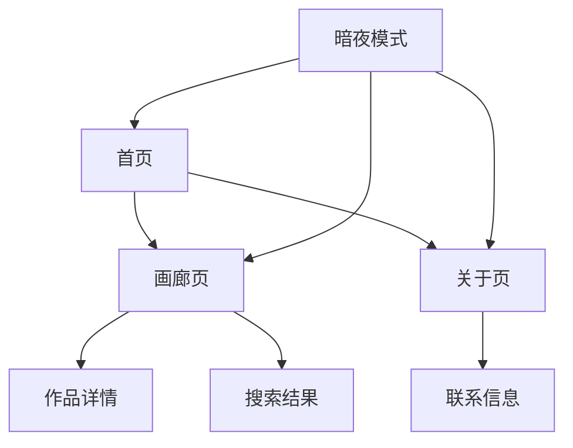

## 1. 产品概述
"苗昀的画廊"是一个现代化的个人艺术作品展示网站，采用Nuxt SSR技术构建。该网站旨在为艺术家提供一个优雅的平台来展示其作品集合，让访客能够轻松浏览和发现精美的艺术作品。

目标用户包括艺术爱好者、潜在买家以及希望了解苗昀艺术创作的访客。通过响应式设计和移动端优化，确保在各种设备上都能获得出色的浏览体验。

## 2. 核心功能

### 2.1 用户角色
本网站主要面向访客用户，无需注册即可浏览所有内容：

| 角色 | 访问方式 | 核心权限 |
|------|----------|----------|
| 访客用户 | 直接访问 | 浏览所有艺术作品、使用搜索和筛选功能、切换显示模式、开启暗夜模式 |

### 2.2 功能模块
网站包含以下核心页面：
1. **首页**：展示英雄区域、统计数据、精选作品
2. **画廊页面**：艺术作品列表、搜索筛选、分页浏览
3. **关于页面**：艺术家介绍和联系信息

### 2.3 页面详情
| 页面名称 | 模块名称 | 功能描述 |
|----------|----------|----------|
| 首页 | 导航栏 | 显示网站标题、主要导航链接、暗夜模式切换按钮 |
| 首页 | 英雄区域 | 展示主标题"探索 艺术之美"、副标题描述、两个CTA按钮（立即体验、了解更多） |
| 首页 | 统计数据 | 显示四个统计卡片：艺术作品数量、艺术家数量、艺术分类数量、访客数量 |
| 首页 | 精选作品 | 展示精选艺术作品卡片，支持点击查看详情 |
| 画廊页 | 搜索栏 | 输入关键词搜索艺术作品 |
| 画廊页 | 分类筛选 | 下拉选择艺术分类进行筛选 |
| 画廊页 | 排序选项 | 选择排序方式（最新发布、最受欢迎等） |
| 画廊页 | 视图切换 | 切换网格视图和列表视图 |
| 画廊页 | 作品列表 | 展示艺术作品缩略图，支持分页浏览 |
| 关于页 | 艺术家介绍 | 展示苗昀的个人简介和艺术理念 |
| 关于页 | 联系信息 | 提供联系方式和社交媒体链接 |

## 3. 核心流程
用户访问网站的主要流程：
1. 用户通过任何页面进入网站
2. 系统检测用户设备类型，自动适配响应式布局
3. 用户可以通过导航栏在不同页面间切换
4. 在画廊页面，用户可以使用搜索、筛选、排序功能查找作品
5. 用户可以切换视图模式（网格/列表）和暗夜模式
6. 浏览完成后，用户可以通过页脚链接获取更多信息

## 4. 用户界面设计

### 4.1 设计风格
- **主色调**：紫色到蓝色渐变（#5b78f0 → #6f48c2）
- **辅助色**：橙色（CTA按钮）、金色（标题强调）、天蓝色（品牌色）
- **按钮样式**：圆角设计，主要按钮使用渐变色，次要按钮使用边框样式
- **字体**：现代无衬线字体，标题使用粗体，正文字体清晰易读
- **布局风格**：卡片式布局，留白充足，层次分明
- **图标风格**：简约线条图标，与整体设计风格保持一致

### 4.2 页面设计概览
| 页面名称 | 模块名称 | UI元素 |
|----------|----------|----------|
| 首页 | 导航栏 | 白色背景，左侧圆形天蓝色品牌按钮，中间导航文字，右侧月牙形暗夜切换图标 |
| 首页 | 英雄区域 | 全屏紫蓝渐变背景，左侧白色和金色渐变标题，白色副标题，橙色和灰色CTA按钮 |
| 首页 | 统计数据 | 浅灰渐变背景，四个白色圆角卡片，蓝色数字，灰色标题文字 |
| 画廊页 | 搜索筛选区 | 白色卡片包含搜索框、两个下拉选择器、视图切换按钮 |
| 画廊页 | 作品网格 | 圆角缩略图卡片，悬停效果，响应式网格布局 |

### 4.3 响应式设计
- **移动端优先**：所有设计从移动端开始，逐步适配到桌面端
- **断点设计**：针对手机、平板、桌面设备设置不同的布局断点
- **触摸优化**：按钮和交互元素适合触摸操作，避免过小的点击区域
- **汉堡菜单**：移动端使用汉堡菜单，节省屏幕空间
- **堆叠布局**：移动端采用垂直堆叠布局，确保内容可读性

### 4.4 暗夜模式
- **背景色**：深灰色背景替代白色背景
- **文字颜色**：浅色文字确保在深色背景上的可读性
- **卡片样式**：调整卡片背景色和阴影效果
- **渐变调整**：英雄区域的渐变色彩在暗夜模式下适当调整饱和度
- **图标适配**：确保所有图标在暗夜模式下保持清晰可见