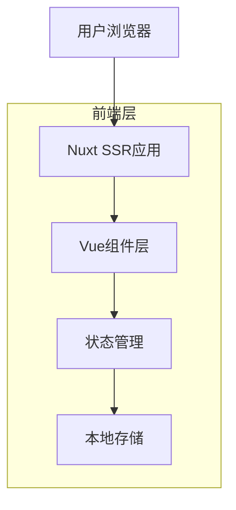

## 1. 架构设计



## 2. 技术栈描述

- **前端框架**: Nuxt@3 + Vue@3
- **初始化工具**: nuxt-init
- **样式框架**: TailwindCSS@3
- **图标库**: Heroicons
- **动画库**: GSAP (可选)
- **后端**: 无（纯静态站点，使用Nuxt SSR渲染）

## 3. 路由定义

| 路由 | 用途 |
|------|------|
| / | 首页，展示英雄区域、统计数据、精选作品 |
| /gallery | 画廊页面，展示所有艺术作品，支持搜索和筛选 |
| /about | 关于页面，展示艺术家介绍和联系信息 |

## 4. 组件架构

### 4.1 核心组件
- `AppHeader`: 顶部导航栏组件
- `HeroSection`: 英雄区域组件
- `StatsSection`: 统计数据展示组件
- `FeaturedWorks`: 精选作品组件
- `GalleryGrid`: 作品网格展示组件
- `SearchFilter`: 搜索筛选组件
- `DarkModeToggle`: 暗夜模式切换组件
- `MobileMenu`: 移动端菜单组件

### 4.2 布局组件
- `default.vue`: 默认布局，包含导航栏和页脚
- `mobile.vue`: 移动端专用布局

## 5. 状态管理

使用Nuxt 3的`useState`和`useCookie`进行状态管理：

```typescript
// 暗夜模式状态
const isDark = useCookie('dark-mode', {
  default: () => false
})

// 画廊筛选状态
const galleryFilters = useState('gallery-filters', () => ({
  search: '',
  category: 'all',
  sort: 'latest',
  viewMode: 'grid' // 'grid' | 'list'
}))

// 分页状态
const pagination = useState('pagination', () => ({
  currentPage: 1,
  itemsPerPage: 12,
  totalItems: 0
}))
```

## 6. 数据模型

### 6.1 艺术作品数据结构
```typescript
interface Artwork {
  id: string
  title: string
  description: string
  imageUrl: string
  category: string
  artist: string
  createdAt: Date
  views: number
  likes: number
}
```

### 6.2 分类数据结构
```typescript
interface Category {
  id: string
  name: string
  slug: string
  count: number
}
```

### 6.3 统计数据结构
```typescript
interface Stats {
  totalArtworks: number
  totalArtists: number
  totalCategories: number
  totalVisitors: number
}
```

## 7. 响应式设计实现

### 7.1 断点设置
```scss
// TailwindCSS默认断点
// sm: 640px
// md: 768px  
// lg: 1024px
// xl: 1280px
// 2xl: 1536px
```

### 7.2 移动端优化策略
- 使用`@nuxt/image`进行图片懒加载和响应式处理
- 实现虚拟滚动优化长列表性能
- 使用`IntersectionObserver`实现懒加载
- 压缩和优化静态资源

## 8. 暗夜模式实现

### 8.1 TailwindCSS配置
```javascript
// tailwind.config.js
module.exports = {
  darkMode: 'class',
  theme: {
    extend: {
      colors: {
        dark: {
          bg: '#1a1a1a',
          card: '#2d2d2d',
          text: '#e5e5e5'
        }
      }
    }
  }
}
```

### 8.2 暗夜模式切换逻辑
```typescript
// composables/useDarkMode.ts
export const useDarkMode = () => {
  const isDark = useCookie('dark-mode', { default: () => false })
  
  const toggleDark = () => {
    isDark.value = !isDark.value
    if (process.client) {
      document.documentElement.classList.toggle('dark', isDark.value)
    }
  }
  
  // 初始化暗夜模式
  if (process.client) {
    document.documentElement.classList.toggle('dark', isDark.value)
  }
  
  return { isDark, toggleDark }
}
```

## 9. 性能优化

### 9.1 SSR优化
- 使用`useAsyncData`进行数据预取
- 实现组件级别的代码分割
- 使用`nuxt/payload`优化客户端导航

### 9.2 图片优化
- 使用WebP格式图片
- 实现响应式图片加载
- 配置CDN加速

### 9.3 缓存策略
- 静态资源使用长期缓存
- API响应使用短期缓存
- 实现Service Worker进行离线支持

## 10. SEO优化

### 10.1 Meta标签管理
```typescript
// 使用Nuxt的useHead composable
useHead({
  title: '苗畅的画廊 - 探索艺术之美',
  meta: [
    { name: 'description', content: '在这里发现世界各地的独特艺术作品，感受创意与灵感的碰撞' },
    { property: 'og:title', content: '苗畅的画廊' },
    { property: 'og:description', content: '探索精美的艺术作品收藏' },
    { property: 'og:image', content: '/og-image.jpg' }
  ]
})
```

### 10.2 结构化数据
- 实现JSON-LD结构化数据
- 优化图片alt属性
- 配置sitemap.xml